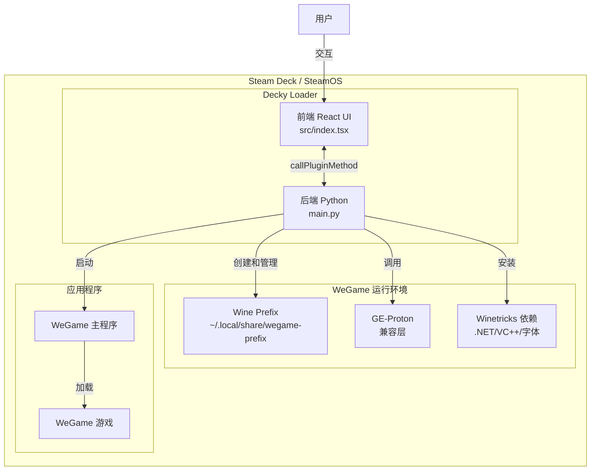
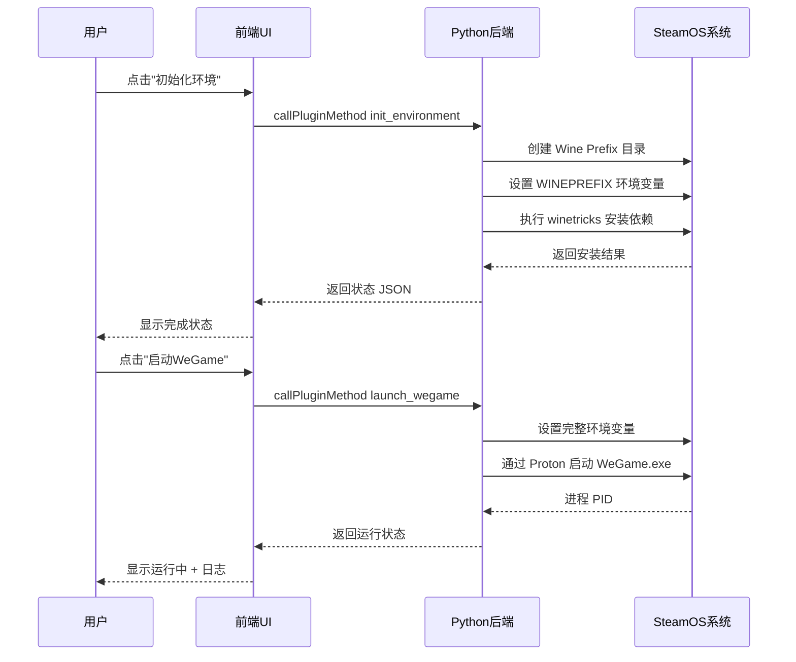

## 产品概述

一款基于 Decky Loader 的 Steam Deck 插件，旨在解决腾讯 WeGame 游戏平台无法在 SteamOS（Linux 环境）上通过 Proton/Wine 兼容层直接运行的问题。插件提供一键式环境配置、依赖安装和游戏启动功能。

## 核心功能

### 环境初始化与管理

- **Wine Prefix 自动创建**：为 WeGame 创建独立的 Wine 前缀目录，避免与其他应用冲突
- **Proton 版本检测与选择**：自动检测系统已安装的 Proton 版本（推荐 GE-Proton），支持用户手动选择
- **依赖组件自动安装**：通过 winetricks 一键安装 WeGame 所需的 Windows 运行时依赖：
- .NET Framework 4.0/4.5/4.6（核心运行时）
- Visual C++ Redistributable 2005-2022（多版本）
- 中文字体支持（微软雅黑、宋体等）
- IE 内核 / WebView2 组件（WeGame 内嵌浏览器依赖）
- gdiplus、mscoree 等 Windows 系统组件

### WeGame 安装与启动

- **WeGame 安装器引导**：支持从本地文件或下载链接获取 WeGame 安装包并在 Wine 环境中执行安装
- **一键启动 WeGame**：配置正确的环境变量（WINEPREFIX、PROTON_PATH 等）启动 WeGame
- **进程管理**：监控 WeGame 运行状态，提供关闭功能
- **日志查看**：实时显示 Wine/Proton 输出日志，便于排查问题

### 配置管理

- **路径配置**：自定义 WeGame 安装路径、Wine 前缀路径、Proton 路径
- **启动参数自定义**：高级用户可修改环境变量和启动参数
- **环境重置**：支持清除并重建 Wine 前缀（修复损坏的环境）

### UI 交互

- 插件主页集成在 Decky Loader 菜单中
- 状态指示器显示当前环境就绪状态
- 操作进度反馈（依赖安装进度条）

## 技术栈选型

| 层级 | 技术选型 | 说明 |
| --- | --- | --- |
| 前端框架 | React + TypeScript | Decky Loader 官方标准前端技术栈 |
| UI 组件库 | @decky/ui | Decky Loader 官方 UI 组件库 |
| 后端语言 | Python 3 | Decky Loader 后端标准语言 |
| 构建工具 | Rollup + pnpm | 官方模板标配构建工具链 |
| 兼容层 | GE-Proton (通过 Wine) | 最优 Windows 兼容性方案 |
| 依赖安装 | winetricks | Wine 环境依赖自动安装工具 |


## 技术架构

### 整体架构

采用 Decky Loader 标准的前后端分离架构：

- **前端层**（React + TypeScript）：负责 UI 渲染、用户交互、状态管理，通过 `ServerAPI` 与后端通信
- **后端层**（Python）：负责系统命令执行（subprocess）、Wine 环境管理、文件系统操作、进程管理
- **通信机制**：前端通过 `serverAPI.callPluginMethod()` 调用后端 Python 方法的 RPC 模式

### 系统架构图



### 数据流图



## 实现策略

### 核心设计决策

1. **独立的 Wine Prefix**：使用 `~/.local/share/steam/compatibilitytools.d/wegame-prefix` 作为专用前缀，避免污染其他应用的兼容环境。独立前缀便于管理和重置。

2. **GE-Proton 作为首选兼容层**：相比原生 Proton，GE-Proton 包含更多补丁和增强，对非 Steam 游戏的兼容性更好。自动扫描 `~/.steam/root/compatibilitytools.d/` 目录查找可用版本。

3. **winetricks 批量预安装依赖**：将所有 WeGame 需要的依赖打包为一个预设脚本顺序执行，减少用户操作步骤。依赖列表基于 WeGame 实际运行需求分析确定。

4. **root 权限按需申请**：`plugin.json` 中设置 `flags: ["root"]` 以获得必要的系统权限（用于安装系统级字体、修改兼容工具目录等）。

5. **异步任务处理**：环境初始化和依赖安装是耗时操作，后端使用 asyncio.subprocess 异步执行，通过回调或轮询向前端报告进度。

### 性能与可靠性考虑

- **热路径**：WeGame 启动时的环境变量设置和进程创建是关键路径，需优化为单次 shell 调用而非多次 subprocess 调用
- **进度反馈**：winetricks 安装过程可能耗时较长（10-30分钟），需要解析 stdout 实时提取进度信息
- **错误恢复**：每步操作记录状态到本地文件，支持中断后从中断点继续；严重失败时提供环境重置选项
- **日志控制**：避免在前端展示敏感信息，过滤环境变量中的密钥类数据

## 目录结构

```
e:/CGL/Programs/Decky-Loader/DeckyWeGame/
├── plugin.json                          # [NEW] 插件元数据：名称、作者、flags(root)、商店信息
├── package.json                         # [NEW] 项目包配置：依赖(@decky/ui)、构建脚本
├── pnpm-lock.yaml                       # [NEW] pnpm 锁定文件
├── main.py                              # [NEW] Python后端入口：Plugin类定义
├── LICENSE                              # [NEW] 开源许可证(MIT)
├── README.md                            # [NEW] 项目说明文档
├── rollup.config.js                     # [NEW] Rollup构建配置
├── tsconfig.json                        # [NEW] TypeScript编译配置
│
├── src/                                 # [NEW] 前端源码目录
│   ├── index.tsx                        # [NEW] 插件主入口：definePlugin定义+Content组件
│   ├── components/                      # [NEW] UI组件目录
│   │   ├── StatusCard.tsx               # [NEW] 环境状态卡片：显示当前prefix/Proton/依赖状态
│   │   ├── SetupWizard.tsx              # [NEW] 初始化向导：引导式环境搭建流程
│   │   ├── LauncherPanel.tsx            # [NEW] 启动面板：启动/停止WeGame按钮+状态
│   │   ├── DependencyList.tsx           # [NEW] 依赖列表：显示已安装/待安装的Windows组件
│   │   ├── ConfigEditor.tsx             # [NEW] 配置编辑器：路径/参数高级设置
│   │   └── LogViewer.tsx                # [NEW] 日志查看器：实时显示运行日志
│   ├── hooks/                           # [NEW] 自定义React Hooks
│   │   ├── useWegameStatus.ts           # [NEW] 轮询WeGame运行状态的Hook
│   │   └── useEnvironment.ts            # [NEW] 管理环境配置状态的Hook
│   ├── utils/                           # [NEW] 前端工具函数
│   │   └── constants.ts                 # [NEW] 常量定义：默认路径、依赖列表等
│   └── types/                           # [NEW] TypeScript类型定义
│       └── index.ts                     # [NEW] 接口类型：EnvironmentConfig、DependencyStatus等
│
├── backend/                             # [NEW] 后端源码目录
│   └── src/
│       ├── __init__.py                  # [NEW] 后端包初始化
│       ├── environment.py               # [NEW] 环境管理模块：WinePrefix创建/删除/检测
│       ├── dependencies.py              # [NEW] 依赖管理模块：winetricks调用、依赖安装状态
│       ├── launcher.py                  # [NEW] 启动管理模块：WeGame进程启动/停止/监控
│       ├── proton.py                    # [NEW] Proton管理模块：版本检测、路径解析
│       └── settings.py                  # [NEW] 设置管理：读写JSON配置文件
│
├── assets/                              # [NEW] 静态资源
│   └── icon.png                         # [NEW] 插件图标(WeGame风格)
│
└── defaults/                            # [NEW] 默认配置和脚本模板
    ├── dependencies.txt                 # [NEW] winetricks依赖清单
    └── launch_env.sh                    # [NEW] WeGame启动环境变量模板脚本
```

## 关键代码结构

### Plugin 类接口（main.py）

```python
class Plugin:
    """DeckyWeGame 后端主类"""
    
    async def get_system_info(self) -> dict:
        """获取系统信息：已安装Proton版本、磁盘空间、架构等"""
        
    async def init_environment(self, config: dict) -> dict:
        """初始化WeGame运行环境：创建Wine Prefix、安装基础组件"""
        
    async def install_dependencies(self, dep_list: list = None) -> AsyncGenerator:
        """批量安装WeGame依赖组件，返回安装进度流"""
    
    async def launch_wegame(self, config: dict) -> dict:
        """启动WeGame主程序，返回进程信息和状态"""
    
    async def stop_wegame(self) -> dict:
        """终止WeGame及其子进程"""
    
    async def get_wegame_status(self) -> dict:
        """查询WeGame当前运行状态"""
    
    async def reset_environment(self) -> dict:
        """清除并重建Wine Prefix（危险操作）"""
    
    async def get_install_log(self) -> str:
        """获取最近的安装/运行日志"""
```

## 设计风格定位

采用 **Cyberpunk Neon UI** 与 **Steam Deck 原生暗色主题** 融合的设计风格。整体以深色系为基础，搭配 WeGame 品牌色（蓝绿色调）作为强调色，营造科技感与游戏氛围兼具的视觉体验。界面布局遵循 Decky Loader 的侧边栏插件规范，确保与系统界面的一致性和沉浸感。

## 页面规划

### 页面一：主控台（Main Dashboard）

插件的核心页面，集中展示所有关键操作入口和状态信息。

- **顶部区域 - 全局状态卡片**：显示当前环境的就绪状态（未初始化/准备中/就绪/运行中），使用动态颜色指示灯配合状态文字描述
- **中上部 - 快捷操作区**：三个主要操作按钮横向排列 — "初始化环境"、"启动 WeGame"、"停止进程"，按钮带有图标和状态禁用逻辑
- **中部 - 环境信息面板**：卡片组形式展示 Wine Prefix 路径及大小、当前使用的 Proton 版本、WeGame 安装路径、已安装依赖数量统计
- **底部 - 最近日志窗口**：可折叠的实时日志区域，显示最近的操作输出（带颜色编码：绿色成功、红色错误、黄色警告）

### 页面二：环境设置（Environment Setup）

分步引导式的环境初始化向导。

- **第一步 - Proton 选择**：下拉选择框列出系统检测到的所有可用 Proton 版本（含 GE-Proton），每个选项显示版本号和路径，带"自动检测最佳版本"快捷选项
- **第二步 - 路径配置**：表单字段设置 Wine Prefix 路径和 WeGame 安装路径，每个输入框旁有"浏览"按钮和"使用默认值"提示
- **第三步 - 依赖确认**：勾选列表展示将要安装的所有 Windows 依赖组件，分组显示（.NET Framework 组、VC++ 运行时组、字体组、其他组件组），每组有全选开关
- **第四步 - 执行安装**：大号开始按钮触发安装，下方显示实时进度条和当前正在安装的组件名称，完成后显示汇总报告

### 页面三：依赖管理（Dependencies Manager）

详细的依赖组件管理界面。

- **顶部工具栏**："刷新状态"按钮、"全部重新安装"按钮、"导出依赖列表"按钮
- **主体 - 依赖列表视图**：表格/列表形式展示每个依赖项的状态（已安装✓/未安装✗/安装中⟳）、名称、版本、说明、最后更新时间，支持按状态筛选
- **底部统计栏**：显示已安装总数、待安装总数、总占用空间估算

### 页面四：高级配置（Advanced Configuration）

面向高级用户的详细设置页面。

- **环境变量编辑区**：键值对编辑表格，允许自定义 WINE/Proton 相关环境变量，带常用变量预设下拉菜单
- **启动参数编辑区**：文本域允许编辑传递给 WeGame 的额外启动参数
- **WeGame 安装区**：上传 WeGame 安装包或输入下载链接，触发 Wine 环境下的安装程序执行
- **危险操作区**（红色警示样式）："重置 Wine Prefix" 按钮、"清除所有缓存" 按钮，均需二次确认弹窗

### 页面五：关于与帮助（About & Help）

插件信息和帮助文档。

- **插件信息卡片**：版本号、作者、GitHub 链接、许可证信息
- **常见问题 FAQ**：可折叠的问题列表，涵盖"卡在0%怎么办"、"如何手动安装依赖"、"日志在哪看"等典型问题
- **故障排除指南**：分步诊断流程，引导用户检查常见问题点