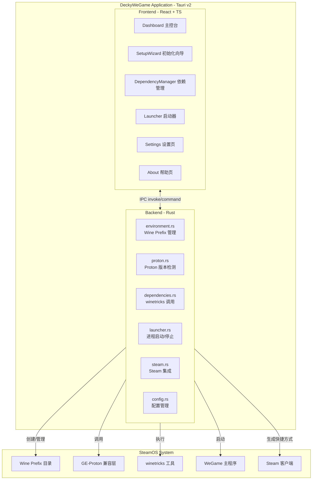
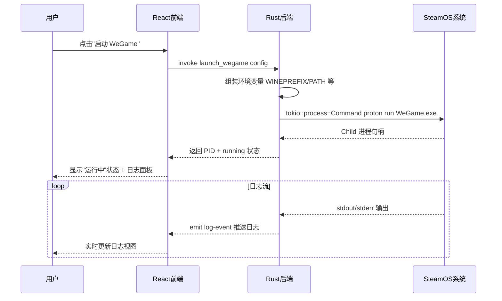

## Product Overview

一款运行在 SteamOS（Steam Deck）上的独立桌面应用程序，用于解决腾讯 WeGame 游戏平台无法通过 Proton/Wine 兼容层直接运行的问题。类似 Heroic Games Launcher 或 EmuDeck，应用独立运行于 SteamOS 桌面环境中，提供 Wine/Proton 环境配置、Windows 依赖自动安装、WeGame 安装与启动管理，并支持将游戏快捷方式添加到 Steam 库中直接启动。

## Core Features

- **Wine Prefix 环境管理**: 为 WeGame 创建独立的 Wine 前缀，支持创建、检测、重置、路径自定义
- **Proton 版本检测与选择**: 自动扫描系统已安装的 Proton 版本（GE-Proton 优先），用户可手动选择兼容层
- **依赖组件自动安装**: 通过 winetricks 一键安装 .NET Framework 4.x、VC++ 运行时（2005-2022）、中文字体、IE 内核组件、gdiplus 等 WeGame 所需的全部 Windows 运行时
- **WeGame 安装引导**: 支持从本地安装包或下载链接获取 WeGame 并在 Wine 环境中执行安装
- **一键启动/停止 WeGame**: 配置完整环境变量后启动 WeGame 主程序，实时监控进程状态
- **Add to Steam 功能**: 将 WeGame 及其游戏生成 Steam 可识别的快捷方式（.desktop 文件 + Steam 非 Steam 游戏），添加到 Steam 库中一键启动
- **日志查看与故障排除**: 实时显示 Wine/Proton 运行日志，提供常见问题 FAQ 和诊断工具
- **高级配置**: 自定义环境变量、启动参数、Wine/Proton 路径等面向高级用户的选项

## Tech Stack Selection

| Layer | Technology | Rationale |
| --- | --- | --- |
| Frontend Framework | React 18 + TypeScript | Tauri v2 官方推荐前端技术栈，生态成熟 |
| Build Tool | Vite 5 | 快速开发构建，Tauri 原生集成 |
| Styling | TailwindCSS 3.4 | 高效实现深色游戏风格 UI |
| Desktop Framework | Tauri v2 (Rust) | 轻量（打包约 10MB）、安全、性能优秀，Rust 后端适合系统级操作 |
| Backend Runtime | Rust (tokio async) | 异步系统命令执行、进程管理、文件系统操作 |
| IPC Mechanism | `#[tauri::command]` + `invoke()` | Tauri v2 标准前后端通信机制 |
| Compatibility Layer | GE-Proton / Proton | 最优 Windows 兼容性方案 |
| Dependency Installer | winetricks | Wine 环境依赖自动安装标准工具 |
| Icon Library | lucide-react + react-icons | 现代图标库 |


## Implementation Approach

采用 Tauri v2 标准架构：**Rust 后端**负责所有系统级操作（Shell 命令执行、进程管理、文件系统操作、Steam 快捷方式生成），**React 前端**负责 UI 渲染和用户交互。两者通过 Tauri IPC (`invoke` / `#[tauri::command]`) 通信。

核心策略：

1. **独立 Wine Prefix**: 使用 `~/.local/share/decky-wegame/prefix` 作为专用前缀，隔离环境
2. **GE-Proton 优先**: 自动扫描 `~/.steam/root/compatibilitytools.d/` 和 `/usr/share/steam/compatibilitytools.d/` 检测可用 Proton
3. **winetricks 批量安装**: 预设 WeGame 依赖清单，异步执行并通过 Event 通道向前端推送进度
4. **Steam 集成**: 生成 `.desktop` 文件和 Steam compat 工具配置，利用 Steam 的 "Add Non-Steam Game" 功能
5. **tokio::process 异步**: 所有耗时操作使用 Rust tokio 异步 runtime，不阻塞 UI 线程
6. **状态持久化**: 使用 JSON 配置文件存储用户设置，支持导入/导出

## Architecture Design

### System Architecture



### Data Flow - WeGame Launch



### Key Design Decisions

1. **Tauri v2 Capabilities 权限模型**: 在 `capabilities/` 中精细配置 Shell 执行、文件系统访问权限范围
2. **进度反馈机制**: winetricks 安装使用 `tauri::Emitter` 通过 Event 向前端推送实时进度（避免长轮询开销）
3. **Steam Shortcut 格式**: 生成符合 Steam 非 Steam 游戏规范的 `.desktop` 文件，包含 Proton 兼容层启动参数
4. **错误恢复**: 每步操作状态持久化到 JSON 文件，支持断点续传；环境损坏时提供重置选项
5. **root 权限**: 使用 `pkexec` 或 `polkit` 按需申请 root 权限（仅用于系统字体安装等必需场景）

## Directory Structure

```
e:/CGL/Programs/Decky-Loader/DeckyWeGame/
├── src-tauri/                              # [NEW] Tauri Rust 后端
│   ├── Cargo.toml                          # [NEW] Rust 依赖：tokio, serde, tauri, etc.
│   ├── tauri.conf.json                     # [NEW] Tauri 应用配置：窗口/权限/安全
│   ├── capabilities/                       # [NEW] Tauri v2 权限配置
│   │   └── default.json                    # [NEW] 默认能力：shell/fs/dialog 权限
│   ├── src/                                # [NEW] Rust 源码
│   │   ├── main.rs                         # [NEW] Tauri 入口：注册 commands、setup app
│   │   ├── commands.rs                     # [NEW] Command 定义层：所有 #[tauri::command] 函数
│   │   ├── environment.rs                  # [NEW] Wine Prefix 创建/删除/检测/大小计算
│   │   ├── proton.rs                       # [NEW] Proton 版本扫描/验证/默认选择逻辑
│   │   ├── dependencies.rs                 # [NEW] winetricks 调用/依赖清单/安装状态跟踪
│   │   ├── launcher.rs                     # [NEW] WeGame 进程启动/停止/生命周期管理
│   │   ├── steam.rs                        # [NEW] .desktop 文件生成/Steam 添加逻辑
│   │   ├── config.rs                       # [NEW] 配置文件读写/默认值/校验
│   │   └── lib.rs                          # [NEW] 模块导出/共享结构体定义
│   └── icons/                              # [NEW] 应用图标各尺寸
│
├── src/                                    # [NEW] 前端 React 源码
│   ├── main.tsx                            # [NEW] React 入口：ReactDOM.createRoot
│   ├── App.tsx                             # [NEW] 根组件：路由布局 + 导航框架
│   ├── index.css                           # [NEW] 全局样式：Tailwind 指令 + 自定义主题
│   ├── vite-env.d.ts                       # [NEW] Vite 类型声明
│   ├── pages/                              # [NEW] 页面组件
│   │   ├── Dashboard.tsx                   # [NEW] 主控台页面：状态卡片+快捷操作+环境信息
│   │   ├── SetupWizard.tsx                 # [NEW] 环境初始化向导：分步引导流程
│   │   ├── Dependencies.tsx                # [NEW] 依赖管理页面：列表/安装/状态
│   │   ├── Launcher.tsx                    # [NEW] 启动器页面：WeGame 控制+游戏库
│   │   ├── Settings.tsx                    # [NEW] 高级设置页面：路径/参数/环境变量
│   │   └── About.tsx                       # [NEW] 关于帮助页面：FAQ/诊断/版本信息
│   ├── components/                         # [NEW] 可复用 UI 组件
│   │   ├── StatusCard.tsx                  # [NEW] 状态指示卡片组件
│   │   ├── ProgressBar.tsx                 # [NEW] 进度条组件（带动画）
│   │   ├── DependencyItem.tsx              # [NEW] 单个依赖项展示组件
│   │   ├── GameEntry.tsx                   # [NEW] 游戏条目组件（用于 Add to Steam）
│   │   ├── LogViewer.tsx                   # [NEW] 日志查看器组件（颜色编码）
│   │   ├── ConfirmDialog.tsx               # [NEW] 确认对话框组件
│   │   ├── Sidebar.tsx                     # [NEW] 侧边导航栏组件
│   │   └── HeaderBar.tsx                   # [NEW] 顶部标题栏组件
│   ├── hooks/                              # [NEW] 自定义 Hooks
│   │   ├── useWegameStatus.ts             # [NEW] WeGame 运行状态轮询 Hook
│   │   ├── useEnvironment.ts              # [NEW] 环境配置状态管理 Hook
│   │   ├── useInstallProgress.ts          # [NEW] 安装进度事件监听 Hook
│   │   └── useProtonVersions.ts           # [NEW] Proton 版本列表获取 Hook
│   ├── utils/                              # [NEW] 前端工具
│   │   ├── constants.ts                    # [NEW] 常量：默认路径、依赖列表定义
│   │   └── helpers.ts                      # [NEW] 辅助函数：格式化、校验等
│   └── types/                              # [NEW] TypeScript 类型定义
│       └── index.ts                        # [NEW] 接口：EnvironmentConfig, DependencyStatus, ProtonInfo, etc.
│
├── public/                                 # [NEW] 静态资源
│   └── wegame-icon.svg                    # [NEW] WeGame 品牌图标
│
├── index.html                              # [NEW] HTML 入口
├── package.json                            # [NEW] 前端依赖配置
├── pnpm-lock.yaml                          # [NEW] pnpm 锁定文件
├── vite.config.ts                          # [NEW] Vite 构建配置（含 Tauri 插件）
├── tsconfig.json                           # [NEW] TypeScript 编译配置
├── tsconfig.app.json                       # [NEW] TS 应用配置
├── tsconfig.node.json                      # [NEW] TS Node 配置
├── tailwind.config.js                      # [NEW] Tailwind CSS 配置
├── postcss.config.js                       # [NEW] PostCSS 配置
├── README.md                               # [NEW] 项目说明文档
└── LICENSE                                 # [NEW] 开源许可证
```

## Implementation Notes

- **Grounding**: 使用 Tauri v2 官方项目模板（`npm create tauri-app@latest`）作为基础骨架，遵循其标准的 `src-tauri/` + `src/` 目录约定
- **Performance**: 
- WeGame 启动为热路径，使用单次 `tokio::process::Command` 调用组装所有环境变量
- winetricks 进度通过 `tauri::Event` 异步推送，前端使用 `listen()` 监听而非轮询
- 日志输出使用环形缓冲区（最近 1000 行），避免内存无限增长
- **Blast radius control**: 
- Wine Prefix 操作限定在 `~/.local/share/decky-wegame/` 目录内
- Shell 命令仅白名单允许的程序路径（wine, winetricks, proton 等）
- Steam 快捷方式写入 `~/.local/share/applications/` 和 Steam config 目录

## Design Style Overview

采用 **类 Steam 游戏平台风格** 的深色主题设计，融合 Cyberpunk Neon 元素营造科技感与游戏氛围。整体以深邃的暗色系为基础底色，搭配 WeGame 品牌蓝绿色调作为主强调色，辅以霓虹光效和玻璃拟态卡片打造高端质感。

界面参考 Heroic Games Launcher 的侧边栏导航布局和 EmuDeck 的向导式引导体验，确保在 Steam Deck 小屏幕上依然清晰可用。所有交互元素带有微动效（hover 发光、按钮按压回弹、状态切换渐变），让界面感觉响应灵敏且富有生命力。

## Page Design Details

### Page 1: Dashboard (Main Dashboard)

主控台是应用的首页，集中展示全部关键信息和快捷操作入口。

- **Block 1 - Global Status Banner**: 顶部横幅区域，左侧显示动态状态指示灯（未初始化灰/准备中黄/就绪绿/运行中蓝）配合大号状态文字，右侧显示当前版本号和更新提示徽章。背景使用微妙的渐变色区分不同状态
- **Block 2 - Quick Actions Bar**: 三到四个主要操作按钮横排排列 — "初始化环境"、"安装依赖"、"启动 WeGame"、"添加到 Steam"。每个按钮配有 lucide-react 图标，根据当前状态自动启用/禁用并附带原因提示
- **Block 3 - Environment Info Cards**: 四张信息卡片以 2x2 网格排列 — Wine Prefix 卡片（路径+磁盘占用）、Proton 版本卡（当前选中版本+切换入口）、WeGame 安装卡（检测到的安装路径+版本）、依赖状态卡（已安装/总数比例条）。每张卡片使用半透明玻璃拟态风格，hover 时微微上浮并发光
- **Block 4 - Live Log Panel**: 底部可折叠区域，标题栏带展开/收起箭头，内部为终端风格的日志显示区，使用等宽字体，日志行按类型着色（绿色成功、红色错误、黄色警告、白色普通信息），带自动滚动到底部功能

### Page 2: Setup Wizard (Environment Initialization)

引导式四步环境搭建向导，每一步有明确的进度指示。

- **Block 1 - Wizard Header**: 顶部显示步骤指示器（四步圆点连线），当前步骤高亮为品牌色，已完成步骤显示绿色勾，未到达步骤灰色。右侧有"跳过此步"和"返回"链接
- **Block 2 - Step Content Area**: 中央大区域根据当前步骤显示不同内容：
- Step 1 "选择 Proton": 下拉选择框列出所有检测到的 Proton 版本，每个选项显示版本名称和完整路径，顶部有"自动推荐最佳版本"高亮按钮，底部显示该版本的兼容性说明
- Step 2 "配置路径": 两组输入框 — Wine Prefix 路径和 WeGame 安装目录，每个旁有文件夹浏览按钮和"恢复默认"链接，下方显示目标分区剩余空间
- Step 3 "确认依赖": 分组勾选列表，四组可折叠面板（.NET Framework / VC++ 运行时 / 字体与渲染 / 其他组件），每组有全选复选框，每个依赖项显示名称、大小估算、必要性标签
- Step 4 "开始安装": 大型居中按钮触发安装，下方为双进度条（总体进度 + 当前单项进度），底部实时滚动的安装日志文本区
- **Block 3 - Wizard Navigation**: 底部固定导航栏，左侧"上一步"按钮（第一步时禁用），右侧"下一步"/"完成"按钮（依赖当前步骤必填项完整性）

### Page 3: Dependencies Manager (Dependency Management)

详细的依赖组件管理界面，提供细粒度控制。

- **Block 1 - Toolbar**: 顶部工具栏，左侧标题"依赖管理"，右侧三个操作按钮 — 刷新检测状态（圆形刷新图标）、批量重新安装（下载图标）、导出报告（文档图标）。工具栏下方有筛选标签栏：全部 / 已安装 / 未安装 / 安装失败
- **Block 2 - Dependency List**: 主体区域为虚拟滚动列表（应对大量依赖项），每一行为一个依赖项：左侧彩色状态圆点（绿=已安装/红=缺失/黄=需更新/蓝=安装中），中间依赖名称和版本号，右侧说明文字和最后安装时间戳。整行 hover 时高亮，点击可展开详情（安装位置、文件校验等）
- **Block 3 - Summary Footer**: 底部固定统计栏，左中右三段式布局 — 左侧"已安装 X/Y 个依赖"，中间总占用空间估算（如"共占用 ~2.3GB"），右侧"上次检查: 2026-04-15 23:30"

### Page 4: Settings & Advanced Configuration

面向高级用户的详细设置页面，分组组织各项配置。

- **Block 1 - Path Configuration**: 路径配置组。卡片容器内含三组路径字段 — Wine Prefix 路径、Proton 可执行文件路径、WeGame 安装路径。每组有浏览按钮和"检测有效性"按钮（检测通过显示绿勾，失败显示红叉加错误提示）
- **Block 2 - Environment Variables Editor**: 环境变量键值对编辑表格。预设常用变量（WINEPREFIX, WINESERVER, STEAM_RUNTIME 等）供快速添加，支持自定义变量增删改。每组为 key-value 两列输入框，旁有删除按钮
- **Block 3 - Launch Parameters**: 启动参数编辑区。大型文本域预填默认启动参数模板，用户可自由编辑。下方有"恢复默认"链接和语法提示
- **Block 4 - WeGame Installer**: WeGame 安装功能区。上传安装包文件按钮 + URL 下载输入框，选择后在 Wine 环境下执行安装程序，显示安装进度
- **Block 5 - Danger Zone**: 危险操作区（红色边框卡片）。两个大按钮 — "重置 Wine Prefix"（清除重建前缀）、"清除所有缓存"（清理下载缓存和临时文件），点击后弹出二次确认对话框，要求用户手动输入"RESET"确认

### Page 5: About & Help

帮助信息和应用信息页面。

- **Block 1 - About Card**: 应用信息卡片。居中显示应用 Logo 图标（大尺寸），下方应用名、版本号、GitHub 链接按钮、许可证信息（MIT）
- **Block 2 - FAQ Section**: 常见问题折叠面板。5-8 个常见问题，每个可展开查看详细解答："WeGame 安装卡在0%怎么办"、"哪些游戏可以正常运行"、"如何更换 Proton 版本"、"如何手动修复 Wine 环境"、"日志文件保存在哪里"
- **Block 3 - Diagnostic Tools**: 故障诊断工具区。"运行系统诊断"按钮点击后自动检查：Proton 是否存在、Wine Prefix 是否完好、磁盘空间是否充足、依赖是否齐全、网络连接状态，结果以通过/失败列表展示，每项附修复建议

## Agent Extensions

### SubAgent

- **code-explorer**
- Purpose: 在开发过程中搜索和探索多文件代码结构、查找特定模式或跨文件的引用关系
- Expected outcome: 快速定位需要修改的目标文件和代码模式，确保实现的准确性